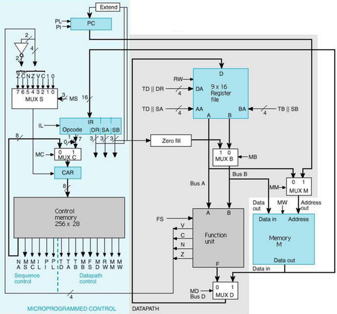
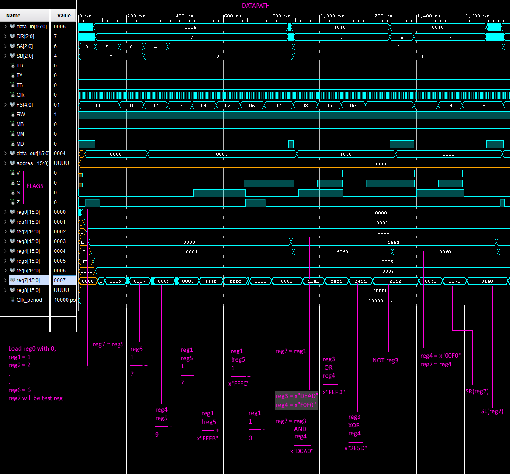

# Multiple-Cycle Microprogrammed Processor

The processor is composed of many individual components written in VHDL including a 9x16 bit Register file, Function unit, 256x28 bit Control memory and supports a microcoded instruction set capable of arithmetic, logic, and shifting operations.

- VHDL code and corresponding testbenches (tb) can be found under `source`.
- Annotated screenshots of the testbenches of individual components can be found under `screenshots`.

## Instructions

Instructions have corresponding micro-operations in Control Memory which tell the components of the processor what to do when the instructions are being performed.  

An instruction in memory is 16 bits long and is laid out in the format:

Opcode    | Destination Register (DR) | Source Register A (SA) | Source Register B (SB)
----------|----------------------|-------------------|--------------------------------------------------
 7 bits   | 3 bits               | 3 bits            | 3 bits

A micro-operation is 28 bits and laid out in the format:
NA | MS	 | MC  | IL  | PI  | PL  | TD  | TA  | TB  | MB  | FS   | MD  | RW  | MM  | MW
------------|------|-----|-----|-----|-----|-----|-----|-----|-----|------|-----|-----|-----|---------------
8 bits      |3 bits|1 bit|1 bit|1 bit|1 bit|1 bit|1 bit|1 bit|1 bit|5 bits|1 bit|1 bit|1 bit|1 bit  

- **Next Address (NA)**: The address of the next micro-operation in control memory.
- **Mux S select (MS)**: Can change the condition for the Control Address Register (CAR) to be incremented rather than loaded with the NA. This is used for micro-operations with multiple operations.
- **Mux C select (MC)**: Signals whether the CAR should be loaded with the next instruction opcode on the next clock cycle.
- **Instruction Load (IL)**: Signals that the Instruction Register (IR) should load the next instruction on the next clock cycle.
- **Program counter Increment (PI)**: Signals that the Program Counter (PC) value should increase by one.
- **Program counter Load (PL)**: Signals that the PC should be offset by the immediate value in the source registers.
- **Temporary Destination (TD)**: Signals that the destination register for the micro-operation should be Register 8.
- **Temporary source A/B (TA/TB)**: Signals that SA/SB for the micro-operation should be Register 8.
- **Mux B select (MB)**: Signals that the immediate value in SB should be used as input to the functional unit instead of the value from the register file.
- **Function Select (FS)**: Selects which function should be performed by the functional unit.
- **Mux D select (MD)**: Selects that the memory's output should be placed in the destination register rather than the output of the functional unit.
- **Read/Write (RW)**: Signals that the input value for the register file should overwrite the value in the destination register.
- **Mux M select (MM)**: Signals that the PC should index memory instead of the value in SA.
- **Memory Write (MW)**: Signals that the input value to memory should overwrite the indexed memory address' value.

## Instruction Set

The following instruction set is available on the processor.

Instruction     | Description
----------------|-------------------------
**LDR**         |   Load into immediate register
**LD**          |   Load to value from memory
**ST**          |   Store a value in memory
**ADD**         |   Add
**ADI**         |   Add immediate constant
**SUB**         |   Subtract
**INC**         |   Increment
**NOT**         |   Logical NOT
**AND**         |   Logical AND
**OR**          |   Logical OR
**XOR**         |   Logical XOR
**SL**          |   Shift Left
**SR**          |   Shift Right
**BEQ**         |   Branch if equal
**BNZ**         |   Branch if not zero

Annotated screenshot of the datapath testbench, showcasing the instructions in action.

